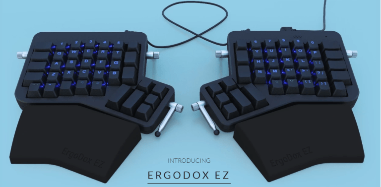
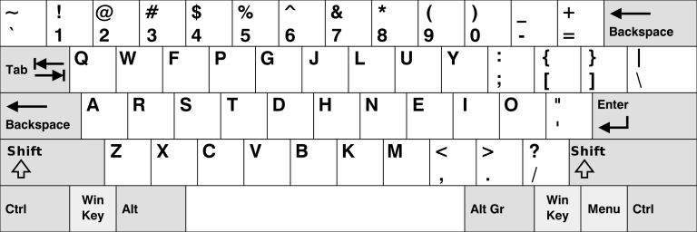
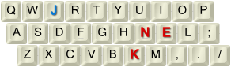
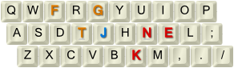
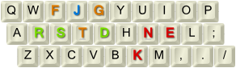
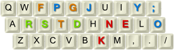
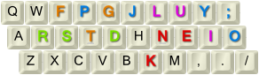

tl;dr – I learn a different keyboard layout – Colemak. I use a tool to only move a few keys around at a time instead of quitting QWERTY cold turkey.

I type on an ErgoDox for my work. I love just about everything about it (save for the hard-to-reach thumb clusters, but everyone complains about that).

That being said, with the Ergodox – I endured about a month of weirdness and awkwardness…. to being happier than I was. I would never go back to a regular keyboard. That was the key point for me to even think about learning a new layout.

Enter Colemak. It’s only half as bad as Dvorak, as only about half the keys move. Your shortcuts like copy and paste don’t move. The allure is just moving your vowels to the homerow, so you do less stretching when you type.

Now enter Tarmak, which makes the process more digestible.

https://forum.colemak.com/topic/1858-learn-colemak-in-steps-with-the-tarmak-layouts/

I made the switch over the course of two months. I’m probably typing at less half speed right now, but the charm of never leaving the home row keeps me there.

What about typing on regular keyboards? This is a big question I often saw asked, as you won’t always be on your own `board. Now being on the other side, I can confirm….. you don’t lose your QWERTY skills. You’ll be a little awkward for about ten minutes and your old habits will kick in. 🙂

Below is a blog of my transition steps over the two months. It might be interesting to you if you ever think about making the change.

Update – April 15th 2019 (Tarmak 1)

…I love where the ‘E’ key is. It makes so much sense being there.

Update – April 24th 2019 (Tarmak 2)

I really like where the ‘e’ key is. Still struggling, but I already feel that my typing speed is back up to about half of what it was.

Update – April 29th 2019 (Tarmak 3)

At this point I am halfway to Colemak and many words I only use one or two fingers to leave the home row – and the rest of the time I am dancing right in the middle. It’s very soothing.

At this point I am still fresh on Tarmak 3, and the r/s being flipped is messing me up, as expected and predicted. As with the last steps, it will start to fade in a few days…

Update – May 10 2019(Tarmak 4)

I was starting to memorize where the ‘J’ key was, so I decided to move it one last time – to it’s final position next to the ‘G’. Using Tarmak the ‘J’ key moves a few times, which sounds awful but in practice I handled it fine. I’m still messing up with the R/S, but the rest of the key from previous steps I have down pat.

Update – May 19th 2019(Tarmak 5)

I had to get into my keyboard settings because of a separate issue with double key presses, so I went ahead and finalized my journey. Final step of Colemak! If anything, the ‘P’ key has been my biggest headache. ‘R’/’S’ can still trip me up, but it’s not as bad as it was last week.

All in all, I am happy with my progress and I do really like how Colemak is laid out. I told myself I would stick with it for at least a month to make my final decision on keeping it or not, but for now, I am content just being that weird person. 🙂

Update - December 16th 2019

It's been over six months since I have switched.

I think the most interesting part about thee entire ordeal is that when I type on someone else's keyboard, I still can, but it feels so _wrong_. And not liike, wrong like I can't do it. Wrong as in everyone else is typing wrong. 

Why do I need to reach for the 'E' key? Why is the 'T' key a canyon away from the home row? 

I have a mentor talk about how people refuse to change, but if you put them in the situation where they have said skill, it will blow their mind. Ie, taking a regular joe and putting them in the body of an athetic. Imagine how good everything would feel. But most people won't take the effort to make the change.

That's how I feel about Colemak and QWERTY.